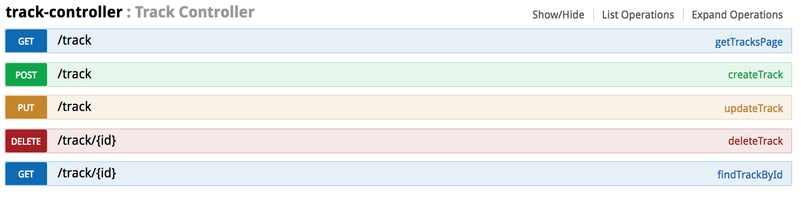

[](https://circleci.com/gh/nouhouari/adsbserver/tree/master)
[](https://circleci.com/gh/nouhouari/trackrepository/tree/master)

### Track Repository project

This project is a POC (Proof of Concept) for a vehicle tracking system.

The goal is to provide a common platform for real time object position tracking
and to experiment some cool technologies i.e :

 * Spring-Boot
 * Docker
 * Kafka
 * Postgis
 * Protobuf 


* Remote track provider

Can be any _hub_ website that provides raw data for vehicles (Flights, Vessels, Car, Human,...)

* Local track provider

A local track provider use a device to receive local tracks.

A device can be :
  * GPS
  * Radar
  * ADSB receiver
  
### Dependencies

A a sample, this project needs some data provided by ADSB exchange website.

You need to compile ADSBServer library available [here](https://github.com/nouhouari/adsbserver)
   

### Build

```bash
mvn clean install
```

Build the docker image
```bash
mvn clean package docker:build
```

### Run

You need Docker and docker-compose to run the sample.

```bash
docker-compose up
```

### Rest API

The tracking system exposes some REST APIs for basic CRUD operations.



More details here : [http://localhost:8080/swagger-ui.html](http://localhost:8080/swagger-ui.html)

### License

MIT
