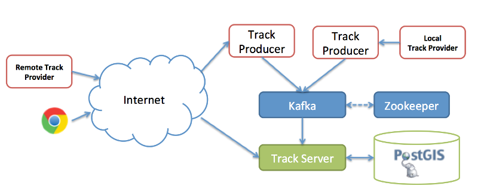

###Track Repository project

This project is a POC (Proof of Concept) for a vehicle tracking system.

The goal is to provide a common platform for real time object position tracking
and to experiment some cool technologies i.e :

 * Spring-Boot
 * Docker
 * Kafka
 * Postgis
 * Protobuf 



* Remote track provider

Can be any _hub_ website that provides raw data for vehicles (Flights, Vessels, Car, Human,...)

* Local track provider

A local track provider use a device to receive local tracks.

A device can be :
  * GPS
  * Radar
  * ADSB receiver 


###Build

```bash
mvn clean install
```

Build the docker image
```bash
mvn package docker:build
```

### Run

You need Docker and docker-compose to run the sample.

```bash
docker-compose up
```

#### License

MIT